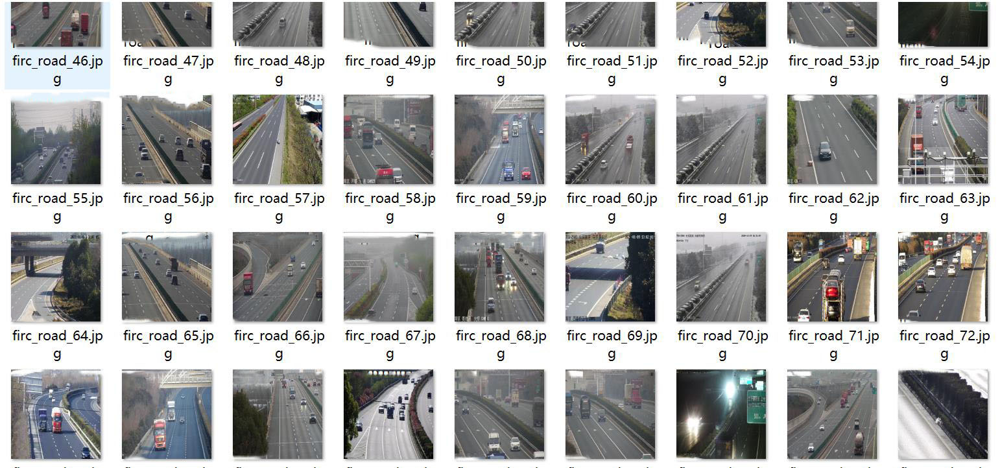
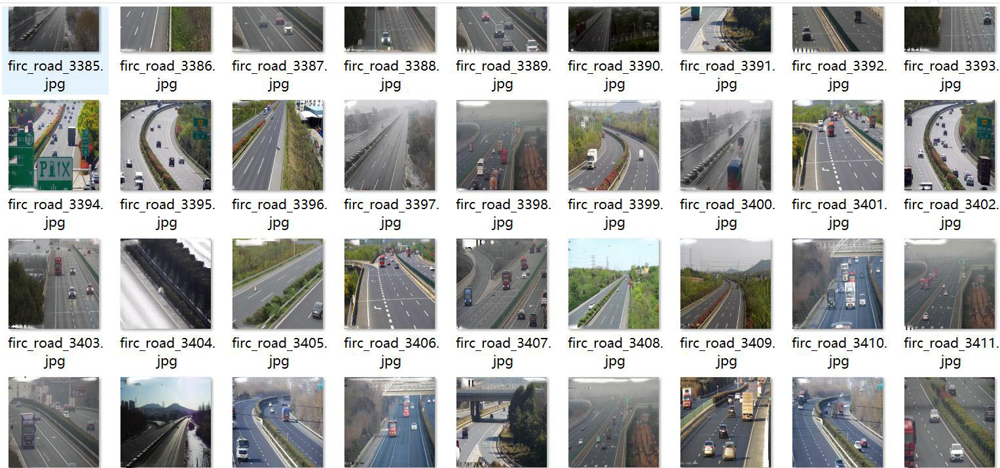
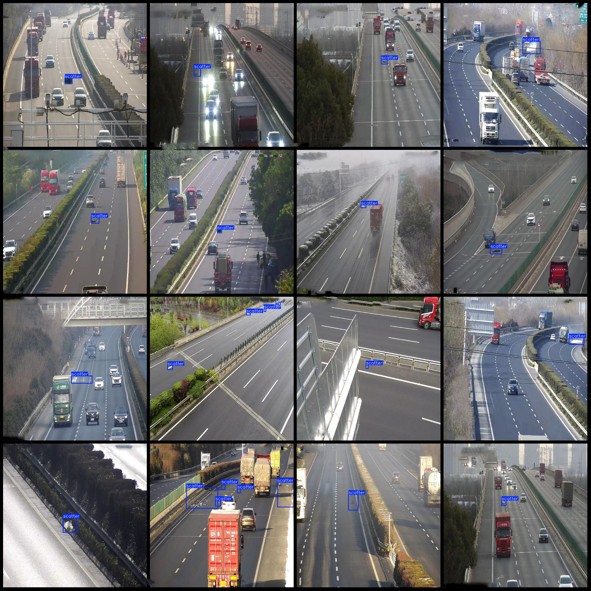
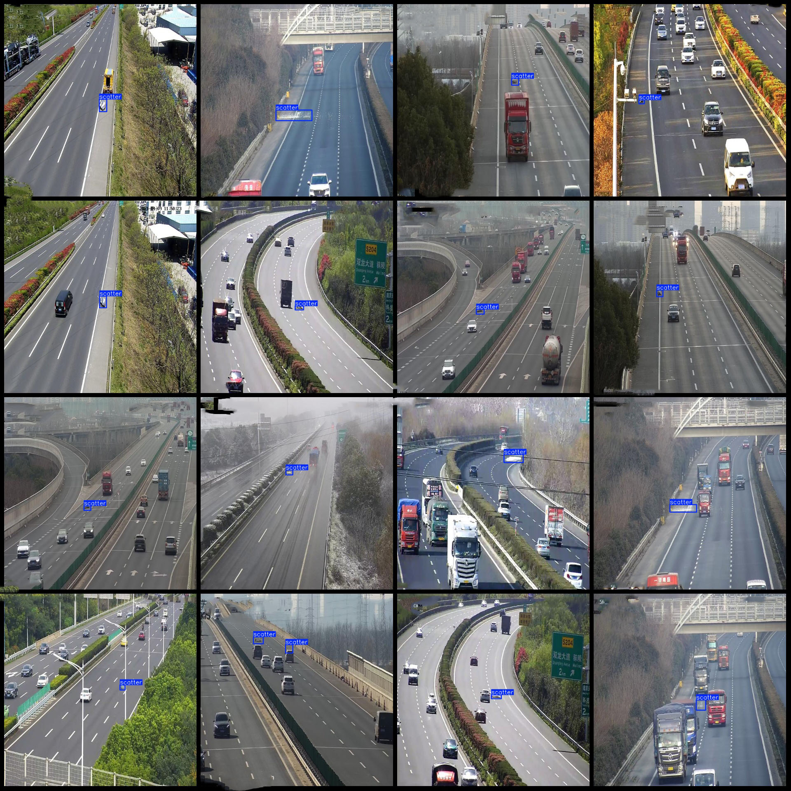

# Wisdom Transportation Highway Urban Road Particle Spillage, Distributed Object Obstacle Detection Dataset VOC+YOLO Format 4521 Images

Dataset Format: Pascal VOC format + YOLO format (excluding the split path in the txt file, only containing jpg images and corresponding VOC format xml files and yolo format txt files)
Image Count: 4521 JPG Files
Annotation Count: 4521 XML Files
Annotation Count: 4521 TXT Files
Number of Annotation Categories: 1
Annotation Category Name: ["scatter"]
Number of Boxes per Category:
scatter (Particle Spillage) Boxes = 6675
Total Boxes: 6675
Image Resolution: 640x640
Annotation Tool Used: labelImg
Annotation Rules: Draw boxes around categories
Important Notes: None
Special Disclaimer: This dataset does not guarantee the accuracy of the trained models or weight files.
Image Preview:
Annotation Example:

## Images

Here is a pay link on Stripe ( https://buy.stripe.com/3cs8yP7sY87d0vu9AB ). Please contact me lonlonago@foxmail.com after funding $89, and I will send you a complete data files , thank you!

